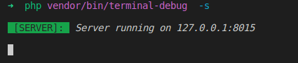
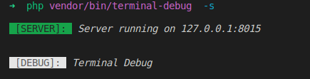
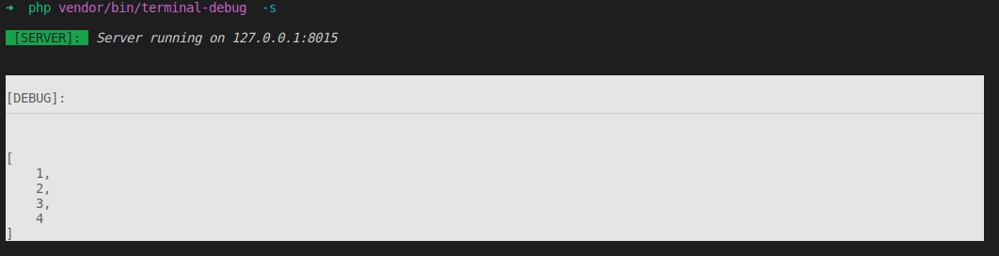
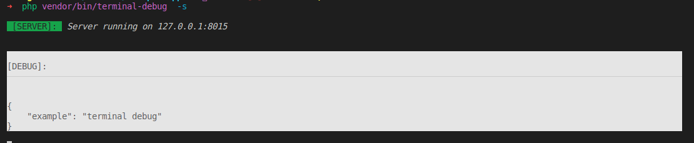
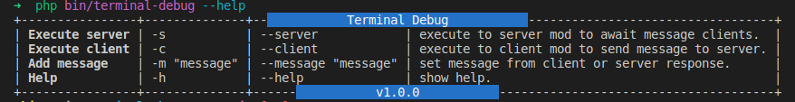

# TERMINAL DEBUG

**Terminal Debug** was born with the purpose of debugging values ​​by printing them directly to the terminal, thus keeping the dev's focus on their code most of the time.

The tool is still in its early stages, so all your suggestions are welcome.

### Requirements
- PHP ^8.0

### Install
- In terminal execute: 

    ```
        composer require thiagomeloo/terminal-debug --dev
    ```
### Usage
- Start the server to listen for debug messages with the following command:

    ```
        php vendor/bin/terminal-debug -s
    ```

- Alternatively you can run the client via the command line:
    ```
        php vendor/bin/terminal-debug -c "terminal debug example"
    ```

### Example
-  To send debug message to the server you have the following options:
    - Print string message:
        ```php
        <?php
            //debug to string
            tDebug("Terminal Debug");
        ```
    - Print array
        ```php
        <?php
            //debug to string
            tDebug([1,2,3, 4]);
        ```
    
    - Print object
        ```php
        <?php
            $obj = (object)[
                "example" => "terminal debug"
            ];
            tDebug($obj);
        ```

### Prints

- Start Server

    <p align="left">
        
    </p>

- Received Message String

    <p align="left">
        
    </p>

- Received Message Array

    <p align="left">
        
    </p>

- Received Message Object

    <p align="left">
        
    </p>

- Command Line Helpers
    <p align="left">
        
    </p>

    

